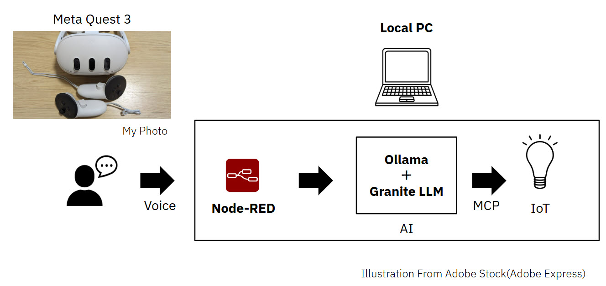
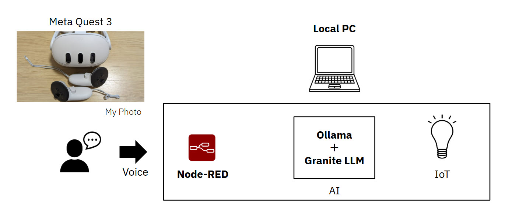
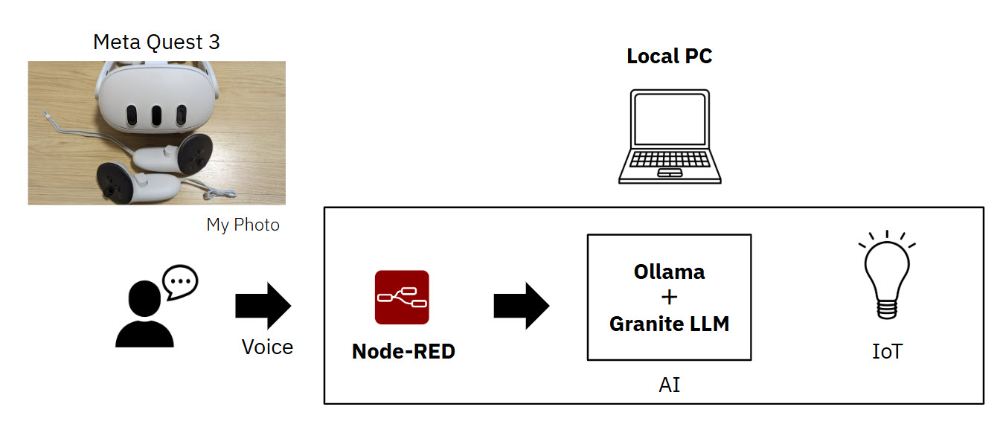
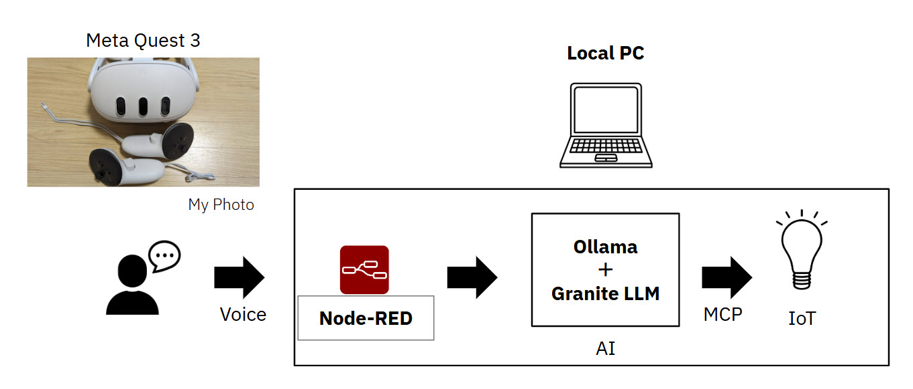
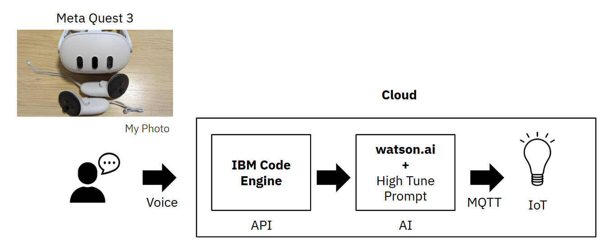

# How It Works

## Today System (Local)

It's overview.

Meta Quest 3 has good noise cancelling. So this can get clear voice audio data. It sends to Whisper API with the voice audio data.

The recorded audio is sent to public Whisper API (transcription API).Whisper API returns the voice-to-text.

It moves AI Processing step.

- Node-RED
  - Ollama API calls with "Turn on light" message.
  - structured outputs JSON scheme with MCP tool list.
- Ollama + Granite LLM
  - Connect to "Turn on light" message to MCP tool choosing.
  - Granite LLM can understanding structured outputs like OpenAI function calling JSON scheme access.

It moves IoT control step.

- Node-RED
  - Node-RED call to simple MCP client.
- simple MCP client
  - Execute IoT MCP control server.
  - IoT MCP control server call IoT Light device with a "true" data state.
- IoT Light device
  - LED on!

## Previous : IBM Code Engine(API part) and watsonx.ai (AI part)

It's overview.