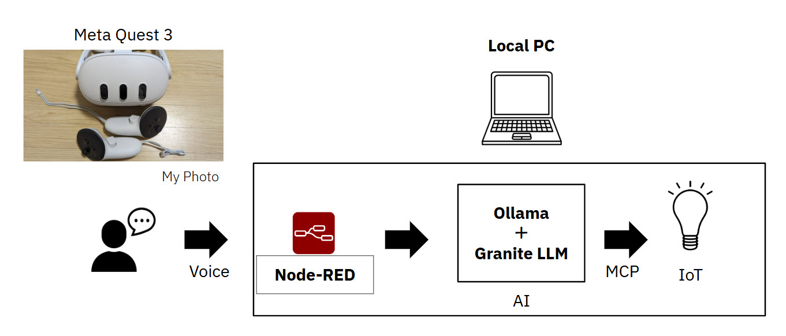
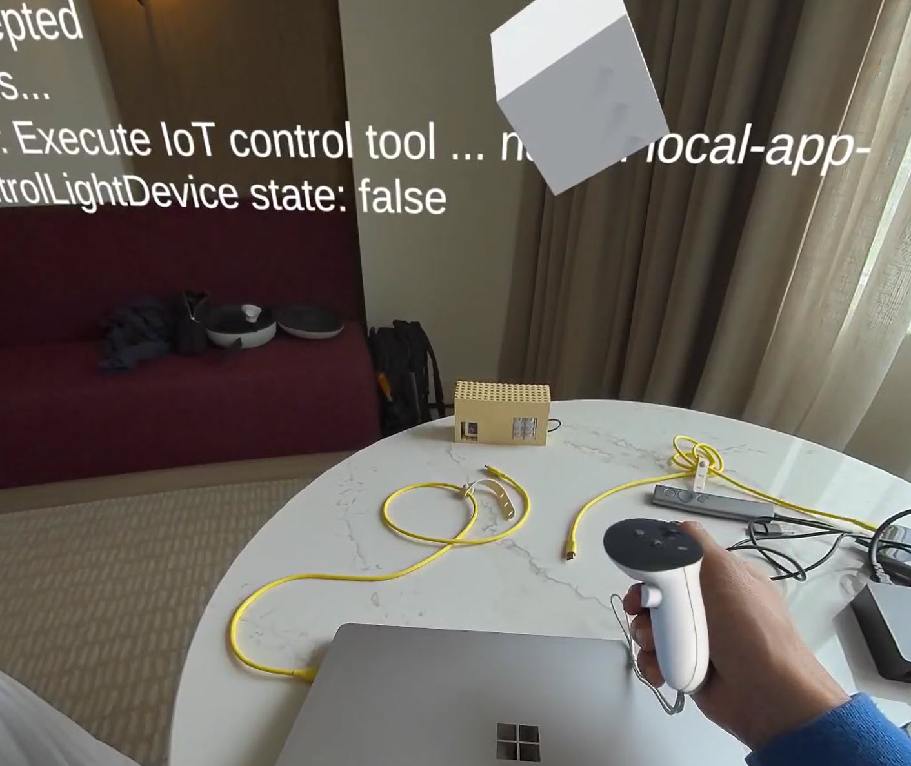
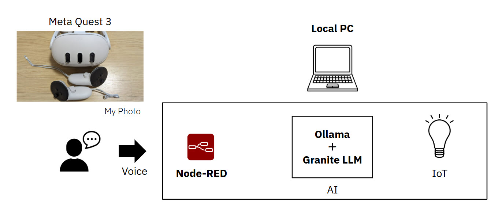
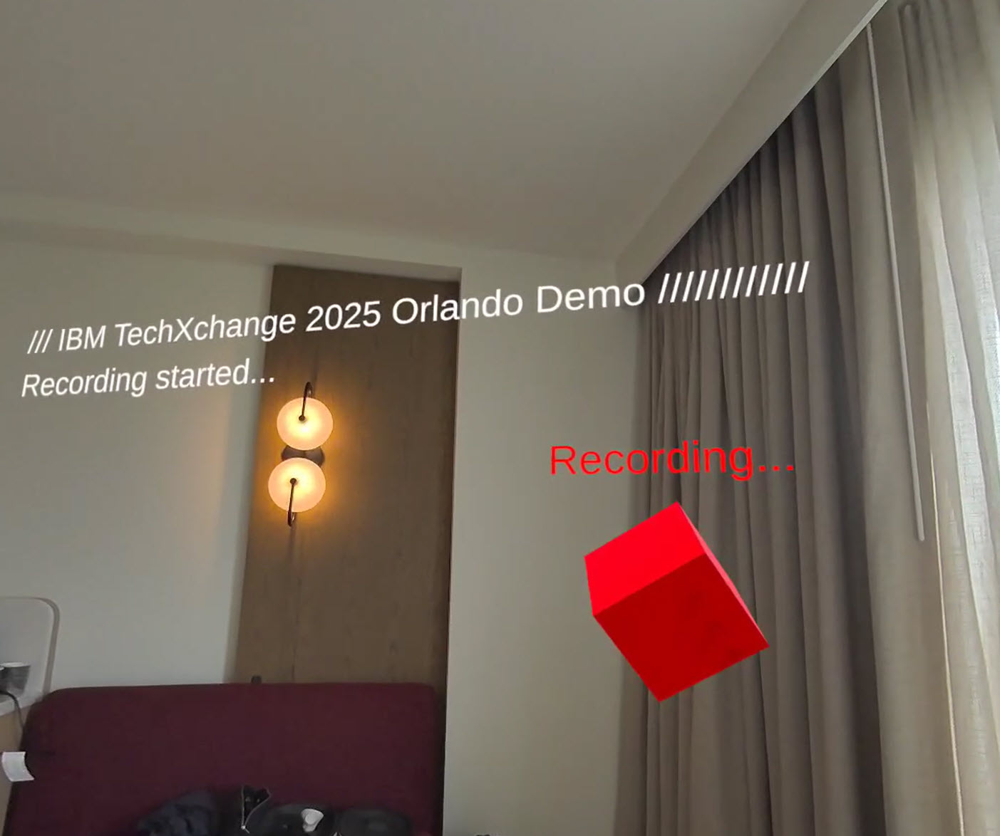
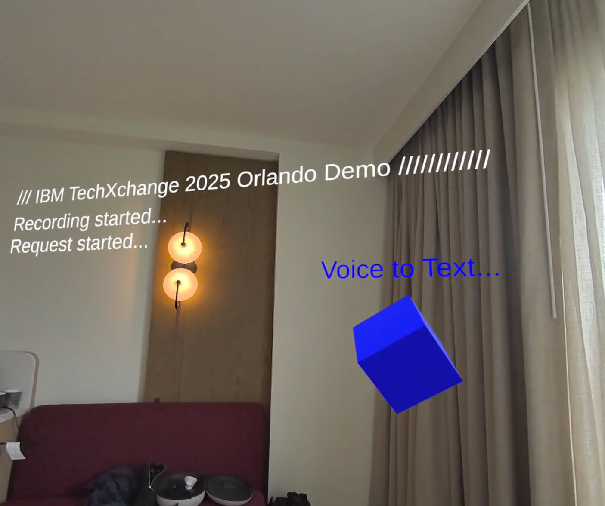
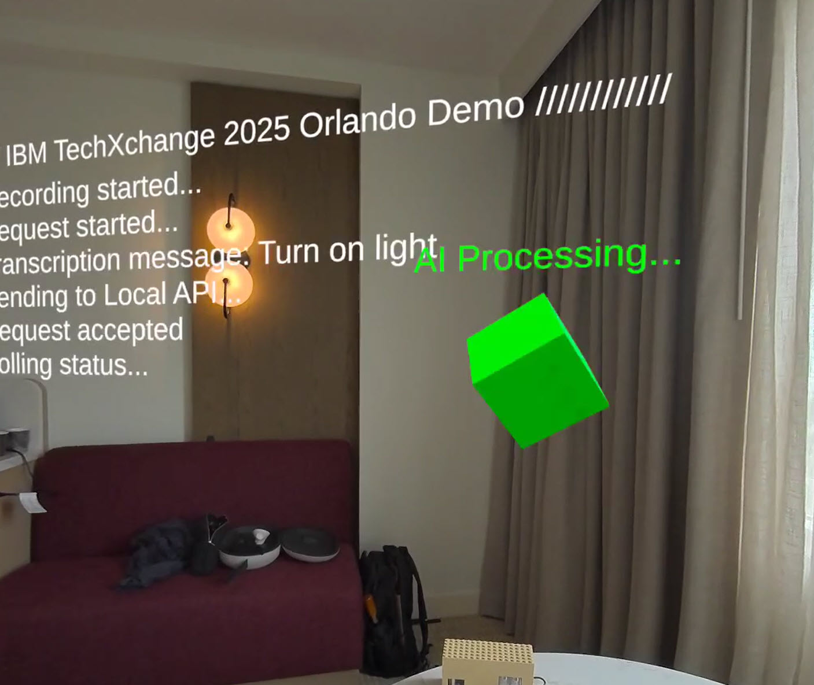
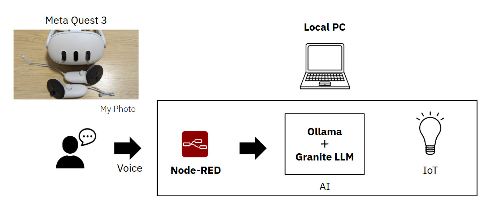

# Live Demonstration!

It's overview.

Meta Quest 3 (XR) UI and IoT Light device.

It's first voice recording step.

It starts voice recording by pressing Button A. I say "Turn on light.".

It stops voice recording by pressing Button A once again. 
The recorded audio is sent to public Whisper API (transcription API).

Whisper API returns the voice-to-text result: "Turn on light".

It moves AI Processing step.

- Node-RED
  - Ollama API calls with "Turn on light" message.
  - structured outputs JSON scheme with MCP tool list.
- Ollama + Granite LLM
  - Connect to "Turn on light" message to MCP tool choosing.
  - Granite LLM can understanding structured outputs like OpenAI function calling JSON scheme access.

It moves IoT control step.

- Node-RED
  - Node-RED call to simple MCP client.
- simple MCP client
  - Execute IoT MCP control server.
  - IoT MCP control server call IoT Light device with a "true" data state.
- IoT Light device
  - LED on!

