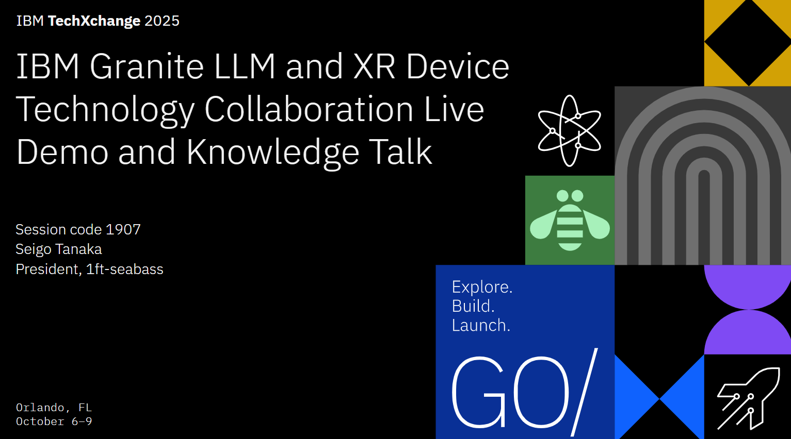

# 1907 IBM Granite LLM and XR Device Technology Collaboration Live Demo and Knowledge Talk

This is the detail of talk in IBM TecnXchange 2025 Orlando. 

## Actual presentation

<iframe class="speakerdeck-iframe" frameborder="0" src="https://speakerdeck.com/player/6c8d2b7863324796a83279ad9d0ed8a5" title="1907 IBM Granite LLM and XR Device Technology Collaboration Live Demo and Knowledge Talk" allowfullscreen="true" style="border: 0px; background: padding-box padding-box rgba(0, 0, 0, 0.1); margin: 0px; padding: 0px; border-radius: 6px; box-shadow: rgba(0, 0, 0, 0.2) 0px 5px 40px; width: 100%; height: auto; aspect-ratio: 560 / 315;" data-ratio="1.7777777777777777"></iframe>

- Sperker Deck
  - https://speakerdeck.com/1ftseabass/ibm-techxchange-2025-orlando

## Detail flows

- [How It Works](./01-how-it-works.md)
- [Live Demonstration!](./02-live-demonstration.md)